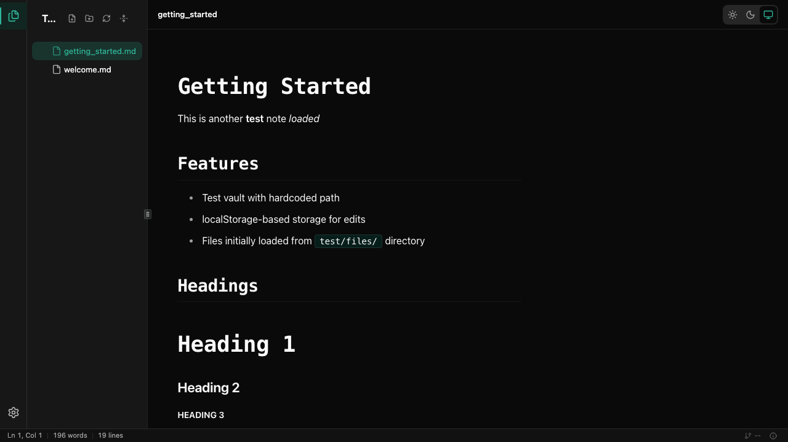
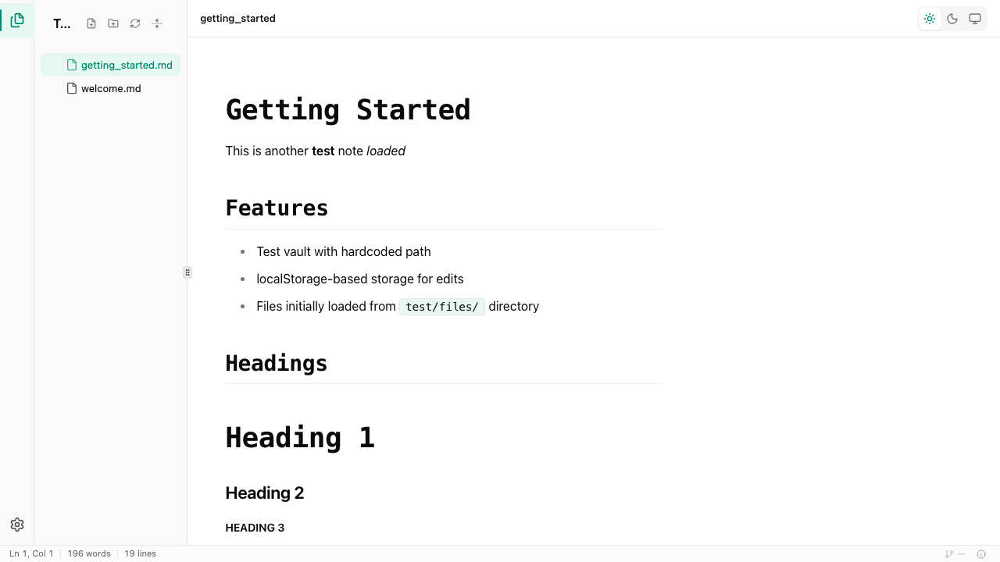

[](https://github.com/ajkdrag/jotter/actions/workflows/release.yml)

# Jotter

A local-first markdown note-taking app for people who want their data to stay on their machine. No accounts, no cloud dependency, no sync fees — just a folder of markdown files you fully own.

<p>
  
  
</p>

## Why Jotter

Most note-taking apps make a trade-off you shouldn't have to accept: either you get good UX with cloud lock-in, or you get local-first with a heavy Electron shell and plugin-hunting to fill feature gaps.

Jotter is built on [Tauri](https://tauri.app/) instead of Electron. The app size is small, starts pretty fast and doesn't eat up your RAM. Your notes are plain markdown files in a folder you control. If you ever want to stop using Jotter, your notes work fine in any other editor.

## Features

- **Vault-based organization** — a vault is just a folder. No proprietary database, no hidden metadata. Open the same folder in VS Code, sync it with git (already supported natively in Jotter), whatever you want.
- **Tab system** — open multiple notes side by side, switch between them, restore closed tabs.
- **WYSIWYG markdown editing** — headings, lists, tables, task lists, code blocks with syntax highlighting, inline formatting. The editor (Milkdown/ProseMirror) renders as you type without switching modes.
- **Wiki-style links** — `[[note-name]]` links between notes. Backlinks and outlinks are tracked automatically and shown in a side panel.
- **Full-text search** — powered by SQLite FTS5. `Cmd+P` opens the command palette; `Cmd+O` searches notes by name. Both run through a single omnibar.
- **Git integration** — view repo status, stage changes, commit with a message, and inspect diffs from within the app.
- **Image support** — paste images from clipboard or drag them in. Assets are stored in a `.assets` folder alongside your markdown.
- **Customizable hotkeys** — every action has a rebindable shortcut. Edit from the settings panel.
- **Dark and light themes** — switchable from the toolbar.

## Building locally

**Prerequisites:**

- [Node.js 20+](https://nodejs.org/)
- [pnpm](https://pnpm.io/) — `npm install -g pnpm`
- [Rust toolchain](https://rustup.rs/) — `curl --proto '=https' --tlsv1.2 -sSf https://sh.rustup.rs | sh`
- On **Linux**: `libwebkit2gtk-4.1-dev`, `libayatana-appindicator3-dev`, and the standard build tools (`build-essential`, `curl`, `wget`, `file`, `libxdo-dev`, `libssl-dev`, `librsvg2-dev`). See the [Tauri prerequisites guide](https://tauri.app/start/prerequisites/).
- On **Windows**: Microsoft C++ Build Tools and WebView2 (usually already present on Windows 11).

**Run in development:**

```bash
pnpm install
pnpm tauri dev
```

The app opens a window. Pick an existing folder or create a new vault to start writing.

**Build a distributable:**

```bash
pnpm tauri build
```

Outputs a signed installer to `src-tauri/target/release/bundle/`.

### Validation commands

```bash
pnpm check           # Svelte/TypeScript type checking
pnpm lint            # oxlint
pnpm format          # Prettier (writes formatting in place)
pnpm format:check    # Prettier (exits non-zero if formatting differs)
pnpm test            # Vitest unit tests
cd src-tauri && cargo check  # Rust type checking
```

Run all of these before submitting a pull request.

## Stack

| Layer    | Tech                            |
| -------- | ------------------------------- |
| Desktop  | Tauri 2 (Rust)                  |
| Frontend | Svelte 5, SvelteKit, TypeScript |
| Editor   | Milkdown (ProseMirror)          |
| Styling  | Tailwind CSS 4, shadcn-svelte   |
| Search   | SQLite FTS5 — rusqlite          |
| State    | Svelte 5 runes                  |

## Project structure

```
src/                   Frontend (Svelte/TS)
  lib/
    ports/             Interface contracts
    adapters/          Platform implementations (tauri/, test/, shared/)
    actions/           Typed action IDs and registry
    services/          Business logic (stateless)
    stores/            Global state (Svelte 5 runes)
    reactors/          Side-effect coordinators (autosave, sync, etc.)
    domain/            Domain utilities and pure logic
    context/           App context and lifecycle hooks
    db/                SQLite schema and query constants
    di/                Dependency injection / port wiring
    components/        Presentational UI
    types/             TypeScript types
    utils/             Utility functions
src-tauri/src/         Backend (Rust)
  app/                 Tauri builder, plugin and command handler wiring
  features/            One module per capability domain
    vault/             Vault registry management
    notes/             Note CRUD and folder operations
    search/            FTS index (build, search, suggest, sync)
    settings/          App-level settings
    vault_settings/    Per-vault settings
    git/               Git operations (status, commit, diff, restore)
    watcher/           Filesystem watcher
  shared/              Cross-feature utilities (vault store, constants, asset handler)
  tests/               Integration test entry points
tests/                 Frontend unit and integration tests
```

Architecture follows a hexagonal (ports/adapters) pattern. See [architecture.md](./architecture.md) for the full breakdown.

## Contributing

The codebase is opinionated. A few things worth knowing:

- Business logic goes in `services/`. Stores hold state. Reactors wire side effects. UI components read stores and dispatch actions.
- See [UI.md](./UI.md) for the design system, tokens, and BEM naming conventions.
- See [architecture.md](./architecture.md) for data flow and layering rules.
- Tests live in `tests/`, not alongside source files.
