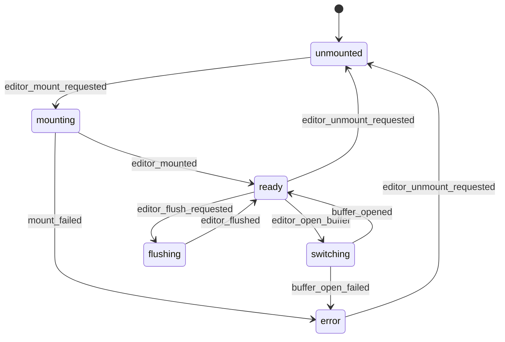

# Proposed Architecture (Hand-off Doc)

This document is the contract for how we build features in Jotter going forward. It is written to be executable as a mental model: if you follow it, you’ll land changes in the right layer, with consistent data flow, and without “one-off hacks”.

---

## Goals

- Add features without inventing new patterns each time.
- Make state transitions auditable and testable.
- Keep UI components dumb and composable.
- Make side effects predictable, cancellable, and easy to reason about.
- Keep ports/adapters clean so we can run in Web or Tauri consistently.

---

## Big Idea: A Single Core Loop

Every feature follows the same loop:

**UI Intent → Command → Flow (UX) → Use Case (effects) → Events → Reducers (stores) → UI reacts → Shell reactions run**

If you’re unsure where code goes, map it onto that sentence.

---

## Layers (What They Are + What They Can Import)

### 1) `types/` (pure)

- Domain + UI-safe types.
- No imports from stores/flows/adapters/components.

**Examples:** `note`, `vault`, IDs, search query types, editor types.

**Constraint:** **Types must not depend on implementation layers.**

---

### 2) `ports/` (contracts)

- Interfaces for external dependencies (filesystem, IPC, indexing, editor, settings, assets, clipboard).
- Only types + interfaces.

**Constraint:** **Ports contain no logic.** (No `toast`, no DOM, no `fetch`, no “helpful” helpers.)

---

### 3) `adapters/` (implementations)

- Concrete implementations of ports for:
  - `web/`
  - `tauri/`
  - `editor/`
  - `test/`

**Constraint:** **Adapters may do IO and runtime work.** They should not mutate stores directly.

---

### 4) `events/` (new, pure)

- Event types are the “language” of state transitions.
- This is where we name what happened (e.g. `note_saved`, `vault_changed`).

**Constraint:** **Events are facts.** They are not instructions like “save the note”.

---

### 5) `stores/` (reducers + state)

- Stores hold long-lived state.
- Stores mutate state only by applying events through reducers.
- Stores expose subscription + snapshot so UI can react.

#### What is a “reducer” (in this codebase)?

A reducer is a **pure** function:

- input: `(current_state, event)`
- output: `next_state`

No IO, no timers, no `document`, no ports, no async. It’s just “given this fact happened, how does state change?”.

Think of reducers as the authoritative “laws of physics” for your app state.

**Example (editor reducer idea):**

```ts
type AppEvent =
  | { type: 'note_saved'; note_id: string }
  | { type: 'note_opened'; note_id: string; markdown: string }

function reduce_editor(state: EditorState, event: AppEvent): EditorState {
  switch (event.type) {
    case 'note_saved': {
      if (!state.open_note) return state
      if (state.open_note.meta.id !== event.note_id) return state
      return { ...state, open_note: { ...state.open_note, is_dirty: false } }
    }
    case 'note_opened': {
      return { ...state, open_note: /* derive OpenNoteState */ null as any }
    }
  }
}
```

You don’t need Redux. This is just the concept: **event in → new state out**.

#### What is a “store” then?

A store is:

- a container for **long-lived state** (vault, notes list, open note, UI preferences),
- plus a small API:
  - `get_snapshot()`
  - `subscribe(listener)`
  - `dispatch(event)` (which runs reducers)

So: **stores are state + reducer application** (and nothing else).

#### Why do we need reducers (instead of calling `store.actions.*` everywhere)?

Because reducers give you:

- one way to change state (auditability),
- deterministic unit tests (“event X produces state Y”),
- no duplication of state transition logic across flows/controllers/components.

**Constraints (non-negotiable):**

- **Stores must not call ports.**
- **Stores must not call use cases.**
- **Stores must not contain async code.**
- **Persistent state mutations happen only in reducers (event handlers).**

---

### 6) `use_cases/` (new, effectful application layer)

- Use cases are the only place we call ports for “business IO”.
- Use cases return `events[]` describing what happened.
- Use cases do not mutate stores directly.

**Constraints (non-negotiable):**

- **Use cases may call ports.**
- **Use cases must not import UI components or UI libraries.**
- **Use cases must not call `document`, `window`, `toast`, or editor managers.**
- **Use cases return events, not store actions.**

---

### 7) `flows/` (XState; UX orchestration)

- Flows manage transient UX process state:
  - dialogs, confirmation steps, loading/error screens, cancellation, retries
- Flows call use cases and apply returned events to stores.

**Constraints (non-negotiable):**

- **Flows do not contain business rules that affect persistent state.**
- **Flows do not call ports directly** (except in rare “pure UI capability” cases explicitly approved).
- **Flows do not import UI libraries** (`toast`, DOM APIs, etc.).

Think: flows orchestrate; use cases decide; stores reduce.

---

### 8) `controllers/` (UI intent → command dispatch)

- Controllers translate UI events into commands sent into flows/runtime.
- Controllers do not do domain logic.

**Constraint:** **Controllers do not call ports and do not do async IO.**

---

### 9) `shell/` (new, runtime-only reactions)

- Shell reactions are UI/runtime side effects triggered by events:
  - `toast` notifications
  - `editor_runtime.mark_clean()`
  - applying editor styles to `document.documentElement`
  - focus management

This keeps use cases pure of UI concerns and removes callback hacks.

#### What is the “shell” in practice?

The shell is the thin runtime glue that:

1) takes events emitted by use cases,
2) dispatches them into stores (reducers),
3) runs **UI-only side effects** in response.

It exists because some side effects are intentionally *not* “business IO”:

- showing a toast,
- focusing an input,
- calling `editor_runtime.mark_clean()`,
- mutating CSS variables.

Those are runtime/UI concerns. If they leak into use cases, the application layer becomes coupled to Svelte/DOM/editor internals and you get callback hacks (`on_save_complete`) to patch it.

**The rule of thumb:**

- If it changes persistent state → reducer.
- If it touches the outside world in a business way (files/index/settings) → use case via ports.
- If it touches UI/runtime (DOM/toasts/editor runtime) → shell reaction.

**Constraints (non-negotiable):**

- **Shell reactions may touch DOM/UI libs/editor runtime.**
- **Shell reactions must not change persistent state directly.**
- **Shell reactions must be driven by events only.**

---

### 10) `components/` (presentational UI)

- Components render based on props.
- Components emit intents via callbacks.

**Constraints (non-negotiable):**

- **Components must not import XState.**
- **Components must not import ports, adapters, or use cases.**
- **Components must not perform IO.**
- **Leaf components are pure presentational. Container components may wire hooks only.**

---

## Dependency Rules (Simple Version)

- `components` → can import `types`, `utils`, `components/ui`
- `controllers` → can import `types`, `events` (command/event types), flow handles
- `flows` → can import `types`, `events`, `use_cases`, `stores` (dispatch), `utils`
- `use_cases` → can import `ports`, `types`, `events`, `utils`
- `stores` → can import `types`, `events`, `utils`
- `adapters` → can import `ports`, `types`, `utils`, platform libs

If you’re about to import “down” into a lower layer (e.g. store importing ports), stop.

---

## Data Flow (What Actually Happens at Runtime)

### Persistent state

1) UI triggers an intent (`on_click_save`)
2) controller emits a command into a flow (`SAVE_REQUESTED`)
3) flow invokes a use case (`save_note_use_case`)
4) use case calls ports (write note, index update) and returns `events[]`
5) flow dispatches events to stores (reducers update state)
6) UI rerenders from store snapshots
7) shell reactions observe events and run UI-only effects (toast/focus/editor manager)

### Transient UX state

Transient UX state is **process state**, not “the truth of the world”.

It answers questions like:

- “Is the delete confirmation dialog currently open?”
- “Are we in the middle of saving?”
- “What error should this dialog show?”
- “What item is selected in the command palette?”

This state:

- is temporary,
- can reset whenever the flow goes back to `idle`,
- should not pollute global stores unless we explicitly want persistence across sessions.

**Where it lives:** inside the XState flow’s current state + flow context.

**How the UI reads it:**

- `flow.snapshot.matches('confirming')` (which state are we in?)
- `flow.snapshot.context` (data needed by the UI for this process)

#### Example: Delete note dialog

Persistent “facts”:

- which notes exist
- which note is open

Transient UX process:

- the dialog is open
- which note is being targeted
- whether we are deleting or showing an error

Flow state machine owns that process:

1) User clicks delete on a note
2) Controller sends flow command: `REQUEST_DELETE { vault_id, note, ... }`
3) Flow transitions to `confirming` and stores `note_to_delete` in flow context
4) UI observes: `delete_note.snapshot.matches('confirming') === true` → shows the dialog
5) User confirms
6) Flow transitions to `deleting`, invokes use case, receives events
7) Flow dispatches events to reducers (persistent state updates)
8) Flow returns to `idle` and clears its transient context
9) UI observes `matches('confirming') === false` → dialog closes

That “open/confirming/deleting/error” lifecycle is exactly what flows are for.

#### Example: Command palette / file search

Command palette has lots of transient UI state:

- open/closed
- current query string
- selection index
- results list

This state is valuable for the interaction, but it’s not “the app’s truth”. If you put it in global stores you:

- bloat persistent state with ephemeral UI details,
- increase cross-feature coupling (unrelated components re-render / subscribe),
- make it easier for state to get “stuck” in weird combinations.

Flows keep it contained and resettable.

---

## Editor Subsystem (First-class, Explicit Contract)

The editor (Milkdown/ProseMirror) is not “just another stateless service”. It is a **stateful UI subsystem** with its own in-memory truth (the ProseMirror document). If we don’t model that explicitly, we inevitably get:

- bespoke managers,
- prop-drilled callbacks,
- and callback hacks like “tell the editor it’s clean after save”.

This architecture makes the editor consistent with the rest of the app by giving it:

- a **transient lifecycle flow** (XState),
- an explicit **event stream** (facts emitted by the editor),
- and a shell-owned **editor runtime** (the thing that actually holds the handle and touches the DOM).

### Sources of truth (non-negotiable)

There are three “truths”, each with a different job:

1) **Editor runtime doc (ProseMirror)** is canonical for **in-flight editing**.
2) **Store markdown/meta** is canonical for **application persistence + cross-feature reads**.
3) **Disk** is canonical for **durable storage**.

**Constraint:** **We never rely on implicit sync.** The contract is: the editor emits events, reducers update store, and saves use store state (with an explicit flush when needed).

### The editor runtime belongs in the shell

The editor runtime is a shell module that owns:

- the actual Milkdown editor instance / handle(s),
- DOM mounting/unmounting,
- plugin wiring,
- and any “UI-only” editor side effects (focus, mark clean, selection restore).

**Constraint:** **No flow/use case/component holds the editor handle directly.** They talk via commands/events.

### Editor commands vs editor events

Use the same language as the rest of the architecture:

- **Commands** = instructions sent to the editor runtime (“do this”)
- **Events** = facts emitted by the editor runtime (“this happened”)

#### Editor commands (examples)

- `editor_mount_requested { root_el, note_id }`
- `editor_unmount_requested`
- `editor_open_buffer { note_id, note_path, markdown, link_syntax }`
- `editor_apply_settings { editor_settings }`
- `editor_insert_text { text }`
- `editor_mark_clean { note_id }`
- `editor_flush_requested { note_id }`

#### Editor events (examples)

- `editor_mounted { note_id }`
- `editor_unmounted`
- `editor_markdown_changed { note_id, markdown }`
- `editor_dirty_changed { note_id, is_dirty }`
- `editor_cursor_changed { note_id, line, column, total_lines }`
- `editor_wiki_link_clicked { note_id, raw_target }`
- `editor_flushed { note_id, markdown }`

### The editor lifecycle flow (transient UX state)

We should add an `editor_flow` whose job is to coordinate the editor runtime lifecycle and keep it consistent with store state.

This is **transient UX state** because it answers process questions like:

- “Is the editor mounted?”
- “Are we switching buffers?”
- “Did the editor fail to mount?”
- “Do we need to flush before a save?”

Mermaid sketch:



**Constraint:** **The flow owns the lifecycle transitions.** The shell owns the runtime handle. Stores own persisted state.

### Data flow examples (so it sticks)

#### A) Typing in the editor

1) User types → ProseMirror doc changes (editor runtime)
2) Editor runtime emits `editor_markdown_changed { note_id, markdown }`
3) Reducer updates store’s `open_note.markdown`
4) UI rerenders anything that depends on store markdown (word count, dirty indicator, etc.)

Optional (later): throttle indexing or expensive derived work based on events in flows/use cases.

#### B) Opening a note

1) User clicks a note in file tree (UI intent)
2) `open_note_flow` runs use case, returns events like `note_opened { note_id, markdown, meta }`
3) Reducers update `editor_store.open_note`
4) `editor_flow` sees “open_note changed” and sends `editor_open_buffer` command to shell runtime
5) Editor runtime mounts/switches buffer, then emits `editor_mounted/buffer_opened`

**Constraint:** **No prop-drilled `on_markdown_change` callbacks.** The only communication is events/commands.

#### C) Saving a note (the “flush” rule)

We want saves to always persist the latest editor content without relying on timing.

1) User hits save → `save_note_flow` enters `saving_requested`
2) Flow sends `editor_flush_requested { note_id }` and waits for `editor_flushed`
3) Reducer applies `editor_flushed` (store now has the exact markdown we will persist)
4) Flow invokes `save_note_use_case` using store snapshot markdown
5) Use case returns `note_saved { note_id }`
6) Reducers set `open_note.is_dirty = false`
7) Shell reaction: on `note_saved` → `editor_mark_clean { note_id }` (or directly `mark_clean()` inside the editor runtime)

This removes `on_save_complete` entirely: **the event drives the reaction**.

#### D) Plugins / autocomplete / agent integrations

Plugins should communicate with the app through editor events, not by directly reaching into stores.

- Plugin detects something → runtime emits event (e.g. `editor_autocomplete_requested { prefix, range }`)
- Autocomplete flow/use case runs search/agent ports → returns events `autocomplete_results_ready`
- UI renders suggestions (transient UX flow state)
- Confirm selection → command `editor_insert_text { text }`

This pattern keeps editor innovation fast without breaking layering.

### Editor port contract (what we should change)

The current “factory + singleton” style (global active editor + `insert_text_at_cursor`) makes ownership unclear.

Proposed shape:

- `EditorPort.create_editor(...) -> EditorHandle`
- All editor operations happen on the handle:
  - `handle.insert_text_at_cursor(...)`
  - `handle.get_markdown()`
  - `handle.mark_clean()`
  - `handle.destroy()`

**Constraint:** **No hidden global active editor inside adapters.** The shell editor runtime owns “what is active”.

---

## How To Build Any Feature (Checklist)

### Step 0 — Name the intent

Write the user story as: “User does X → system does Y → user sees Z”.

### Step 1 — Define commands and events

- Commands: instructions (e.g. `request_save_note`, `confirm_delete_note`).
- Events: facts (e.g. `note_saved`, `note_deleted`, `vault_opened`, `index_updated`).

**Rule:** commands drive effects; events drive state.

### Step 2 — Add use case

Create a use case that:

- receives ports + current state snapshot values it needs
- performs the side effects
- returns `events[]`

### Step 3 — Add reducers

Stores implement reducers for those events.

**Rule:** do not “just call store.actions.set_*” from random layers. Everything goes through event reducers.

### Step 4 — Update flow

Flow:

- transitions UX state
- invokes use case
- dispatches returned events
- handles retry/cancel/timeouts

### Step 5 — Wire controller + UI

- Controller converts UI intent into flow commands.
- UI renders from store + flow snapshots and emits intents via callbacks.

### Step 6 — Add shell reaction (if needed)

If there’s UI-only work that should happen when an event occurs (toast/editor focus/editor manager), implement it as a shell reaction driven by events.

### Step 7 — Tests

- Reducers: unit tests
- Use cases: unit tests with mock ports
- Flows: integration tests (orchestrates + error paths)
- UI: minimal tests unless necessary; prefer testing reducer/use-case behavior

---

## Non-trivial Use Cases (Walkthroughs)

### Use Case A: “Save Note” (untitled + conflict + mark clean)

**User story**

- User edits note. It becomes dirty.
- User hits save:
  - If note is untitled: open “Save As” dialog; confirm path; handle overwrite prompt.
  - If note has a path: write immediately.
- After successful save:
  - persistent state: note exists in notes list, dirty flag false
  - UI-only: editor manager should be marked clean; toast optional

**What goes where**

- Flow: owns dialog states (`idle`, `showing_save_dialog`, `checking_conflict`, `saving`, `error`)
- Use case: `save_note_use_case` performs:
  - write/create note via `notes_port`
  - update index via `workspace_index_port`
  - returns `events` like:
    - `note_saved { vault_id, note_id, path, markdown_hash, mtime_ms? }`
    - `note_created { meta }` (if created)
- Store reducers:
  - update open note meta/path
  - update notes list
  - set `open_note.is_dirty = false` (or store a `last_saved_at`)
- Shell reaction:
  - on `note_saved` → `editor_runtime.mark_clean()`
  - on `note_saved` → optional toast (“Saved”)

**Bold constraints**

- **Use case must not call `editor_runtime`.**
- **Flow must not call `notes_port` directly.**
- **No `on_save_complete` callbacks. The event drives the reaction.**

---

### Use Case B: “Rename Folder” (bulk index update + open note rewrite)

**User story**

- User renames folder `a/` → `b/`.
- All notes under `a/` change paths.
- Open note updates immediately if it is under that folder.
- Index updates to reflect new paths efficiently.

**What goes where**

- Use case:
  - call `notes_port.rename_folder(vault_id, from, to)`
  - determine affected notes based on current notes snapshot (passed in)
  - call indexing in bulk (ideal: `index_rename_prefix` port)
  - return events:
    - `folder_renamed { old_prefix, new_prefix }`
    - `notes_rekeyed { old_prefix, new_prefix, affected_note_ids[] }` (optional)
- Store reducers:
  - rewrite notes paths under prefix
  - update `open_note.meta.path` under prefix
- Flow:
  - handles confirm dialog + retry
  - calls use case and dispatches events

**Bold constraints**

- **Reducers are responsible for path rewrite; don’t hand-roll the same rewrite in flow + store.**
- **Index updates must not be N IPC calls for large folders; add a prefix API in the port.**

---

### Use Case C: “Change Vault” (cancel in-flight loads + prevent stale merges)

**User story**

- User selects a vault; app loads notes and file tree; index builds in background.
- If user switches vault mid-load, old loads must not pollute the new vault.

**What goes where**

- Flow:
  - UX states: dialog open, changing, error
  - on vault change success: dispatch `vault_changed` event
  - on vault change: signal cancellation to any ongoing UX actors (filetree load actors)
- Use case:
  - open vault (choose/select recent) via `vault_port`
  - list notes/folders via `notes_port`
  - start index build as an effect (but report errors via event, not toast)
  - return events: `vault_opened`, `notes_loaded`, `folder_paths_loaded`
- Store reducers:
  - clear state when vault changes (if required)
  - set new vault + notes list
- Filetree flow:
  - must stop in-flight folder-load actors on `vault_changed`
  - must ignore results that don’t match current vault generation

**Bold constraints**

- **No event from old vault may update store state for the new vault.**
- **All async actors must be cancellable or their outputs must be rejected deterministically.**

---

### Use Case D: “Clipboard Copy” (UI feedback without polluting core)

**User story**

- User clicks “Copy Markdown”
- Clipboard write happens
- Show toast success/failure

**What goes where**

- Use case:
  - calls `clipboard_port.write_text(text)`
  - returns events:
    - `clipboard_write_succeeded`
    - `clipboard_write_failed { error }`
- Shell reaction:
  - toast based on those events
- Flow:
  - optional if you need throttling/retry; otherwise controller can directly run a small flow

**Bold constraints**

- **No `toast` usage in flows or use cases.** Toast is shell-only.

---

## Side Effects Policy (Quick Rules)

### Allowed in adapters

- filesystem IO
- IPC/tauri invoke
- web APIs (File System Access API)

### Allowed in use cases

- calling ports
- retries/timeouts (business-level)
- returning events describing results

### Allowed in flows

- UX process orchestration (confirmations, dialogs, loading, retries)
- invoking use cases and dispatching events

### Allowed in shell reactions

- toast / notifications
- DOM mutations (theme, editor styles)
- editor manager calls

---

## Common Anti-patterns (Do Not Do These)

- **A store calls a port or does async IO.**
- **A flow imports a UI library or touches the DOM.**
- **A use case mutates a store directly.**
- **A component imports a port/adapter/use case (even “just for a type”).**
- **A “one-off callback” is added to composition root to patch orchestration.**
- **Two places implement the same state transition (e.g. both flow and store rewrite note paths).**

---

## Feature Template (Copy/Paste Mental Model)

When you add a feature, you should create or update:

1) Command(s) in flow: `*_flow.ts`
2) Use case: `*_use_case.ts`
3) Event(s): `*_events.ts`
4) Reducer(s) in store(s)
5) Shell reaction(s) if needed
6) Controller wiring
7) UI component props + callbacks
8) Tests (reducers + use case + flow)

---

## Naming & File Placement

- Files are `snake_case` (except shadcn UI primitives under `components/ui/**`).
- Use cases live in `src/lib/use_cases/`.
- Events live in `src/lib/events/`.
- Shell reactions live in `src/lib/shell/`.

---

## Final Constraints (Print These)

- **Persistent state changes only via events + reducers.**
- **Use cases are the only layer that calls ports.**
- **Flows orchestrate UX; they do not own domain mutation or UI effects.**
- **UI-only side effects live in shell reactions (toasts, DOM, editor manager).**
- **Components are dumb: no XState, no ports, no adapters, no use cases.**
- **No callback hacks. Cross-cutting behavior is events + reactions.**
